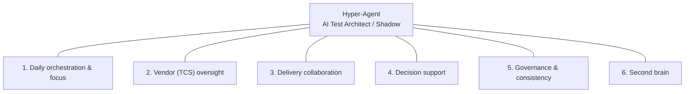

# Hyper-Agent

**Chief test agent** — an AI employee that shadows the Test Manager: vendor oversight (e.g. TCS), delivery collaboration, daily orchestration.

---

## What it is

Hyper-Agent is a private repo for building an AI test architect that acts as your context keeper, evidence gatherer, and draft producer so you can focus on directing vendors, aligning with delivery, and making the calls only you can make.

## Vision

The product vision and how the agent supports a Test Manager’s daily work is documented for review:

**[→ Vision: AI Test Architect / Shadow](docs/VISION-ai-test-architect.md)**

Covers: daily brief & meeting prep, vendor (TCS) oversight, delivery collaboration, decision support, governance, and your “second brain.”

### Capability diagram

*Context keeper · Evidence gatherer · Draft producer*

| Area | Sub-capabilities |
|------|------------------|
| **1. Daily orchestration** | Morning brief · Priority stack · Meeting prep |
| **2. Vendor (TCS) oversight** | Commitment vs actuals · Single view · Escalation support · Consistency |
| **3. Delivery collaboration** | Scope ↔ test alignment · Release readiness · Communication |
| **4. Decision support** | Go/no-go evidence · Prioritization · Impact of changes |
| **5. Governance** | Standards · Patterns |
| **6. Second brain** | Status on demand · Your preferences |

*Full diagram set:* [docs/DIAGRAM-capabilities.md](docs/DIAGRAM-capabilities.md)

## Next steps

**[→ Recommended next steps](docs/NEXT-STEPS.md)** — first capability, data and tools, form factor, tech baseline, and how to build the first slice.

---

## Repo

- **Private** — your space to design and build the agent.
- **Status** — vision documented; implementation to follow.
