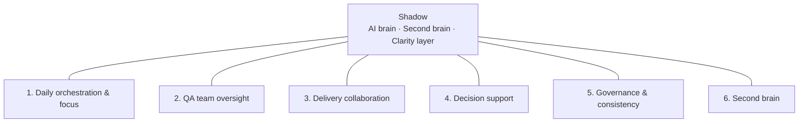

<div align="center">

<a href="https://ElaMCB.github.io/Hyper-Agent/">
  
</a>

*Your AI test architect*

**AI brain · Second brain · Clarity layer**

</div>

---

## The idea

Test leadership is **decision-making under load**: Azure DevOps, Outlook, chat, decks, and memory all compete for the same mental bandwidth. Tools record work; they rarely **synthesize** it for *you* in the moment you need to lead.

**Shadow** is an **intelligence layer** on top of that stack—not a replacement for ADO or your rituals, but a system that:

1. **Ingests** what already exists (work items, runs, exports; calendar and mail when you wire them).
2. **Compresses** it into **briefs, prep, and stakeholder-ready framing** with clear provenance—so you know what it saw and when.
3. **Returns time** for what only you can do: coaching QA, aligning with delivery, owning risk, and signing your name to outcomes.

**Hyper-Agent** is the project that builds **Shadow**. Shadow is the name of the agent you run, deploy, and eventually talk to every day.

### What makes it powerful

| Lever | Why it matters |
|--------|----------------|
| **Rhythm** | A repeatable morning brief (and later, pre-meeting prep) builds *situational awareness* without relying on willpower. |
| **Evidence** | Escalations, steering bullets, and readiness views start from **structured facts**, not what you remembered in the car. |
| **Composable** | Same codebase: files today, **live ADO bugs** now, Outlook/Graph and test runs next—each integration makes the next cheaper. |
| **Human-in-the-loop** | Shadow **frames** and **suggests**; you **edit and decide**. No black-box “the AI said ship it.” |

> Shadow shadows *you*: QA team oversight, delivery collaboration, daily orchestration. It keeps the picture sharp and the paperwork light so your judgment lands with weight.

---

## Vision & capability system

How Shadow maps to a Test Manager’s world:

**[→ Vision (full narrative)](docs/VISION-ai-test-architect.md)** — daily orchestration, QA oversight, delivery, decision support, governance, second brain.

### Capability diagram



| Area | Sub-capabilities |
|------|------------------|
| **1. Daily orchestration** | Morning brief · Priority stack · Meeting prep |
| **2. QA team oversight** | Commitment vs actuals · Single view · Escalation support · Consistency |
| **3. Delivery collaboration** | Scope ↔ test alignment · Release readiness · Communication |
| **4. Decision support** | Go/no-go evidence · Prioritization · Impact of changes |
| **5. Governance** | Standards · Patterns |
| **6. Second brain** | Status on demand · Your preferences |

*More diagrams:* [docs/DIAGRAM-capabilities.md](docs/DIAGRAM-capabilities.md)

---

## Build & evolve Shadow

**[→ Recommended next steps](docs/NEXT-STEPS.md)** — first slice, data sources, form factor, tech baseline.

**[→ How to build (architecture)](docs/BUILD-PLAN.md)** — adapters, capabilities, CLI/API.

---

## Run

From the repo root:

**CLI (morning brief):**
```bash
pip install -r requirements.txt
python src/main.py brief
```
Builds a **Snapshot** (UTC time + sources + defects + test runs), renders the brief, and by default **saves** `output/briefs/brief-YYYY-MM-DDTHHMMSSZ.md` for an audit trail. Toggle in `config/config.yaml` under `output`.

**CLI (daily Headquarters page):**
```bash
python src/main.py headquarters
```
Same snapshot and brief as above, plus a **single HTML dashboard** at `output/headquarters/latest.html` (and a timestamped copy beside it): at-a-glance bullets, defect and test-run tables, sources, optional **quick links** in `config/config.yaml` under `headquarters.links`, and the full brief in a collapsible section. Schedule it nightly (Windows Task Scheduler, `cron`, or the repo workflow **Nightly Headquarters** under `.github/workflows/`) so the file is waiting when you start work. CI uploads `output/headquarters/` as a workflow artifact (add repository secret `AZDO_PAT` if you use Azure DevOps).

**API (deploy or run locally):**
```bash
uvicorn src.api:app --reload --host 0.0.0.0 --port 8000
```
Then open **http://localhost:8000/brief.md** for the brief, **http://localhost:8000/headquarters.html** for the dashboard, **http://localhost:8000/docs** for the API docs.

| Endpoint | Description |
|----------|-------------|
| `GET /` | Service info |
| `GET /brief` | Brief as JSON |
| `GET /brief.md` | Brief as markdown |
| `GET /headquarters.html` | Headquarters dashboard (HTML); `?persist=1` writes `output/headquarters/` if the server can write the repo |
| `GET /health` | Health check |

**Deploy:** [docs/DEPLOY.md](docs/DEPLOY.md) — Railway, Render, Azure, or Docker.

**Data:** `defects.json` and `test_runs.json` in `data/` (samples included). Optional: `llm.enabled` + `OPENAI_API_KEY` in `.env` for LLM-polished briefs.

**Azure DevOps & Outlook:** [docs/INTEGRATION-ADO-OUTLOOK.md](docs/INTEGRATION-ADO-OUTLOOK.md) — live Bugs in the brief; Outlook via Graph or Power Automate.

### Where is Headquarters?

Headquarters is the **HTML dashboard** (not deployed to Pages by default):

| Where | What to do |
|--------|------------|
| **This machine** | Run `python src/main.py headquarters`, then open **`output/headquarters/latest.html`** in a browser (the CLI prints the path). |
| **API** | With the API running, open **`/headquarters.html`** (e.g. `http://localhost:8000/headquarters.html`). |
| **GitHub Actions** | **Actions** → workflow **Nightly Headquarters** → latest run → **Artifacts** → download **`headquarters-…`** → open **`latest.html`** inside the zip. |

---

## Roadmap

| Horizon | Focus |
|---------|--------|
| **Now** | **Snapshot spine** (UTC + sources + provenance) · morning brief · REST API · **Azure DevOps** bugs · timestamped `output/briefs/` |
| **Next** | Meeting prep · **Outlook** (calendar) via Graph or Power Automate · ADO test results |
| **Stretch** | Risk/readiness packs · steering narratives · authenticated endpoints · deeper “ask Shadow” over your data |

This repo is the living implementation of that roadmap—fork, extend, and tune it to how *you* run quality.

---

<div align="center">

[](https://github.com/ElaMCB/Hyper-Agent/graphs/traffic)

*Approximate **Visits** to this README (bots, previews, caches). The [GitHub Pages](https://ElaMCB.github.io/Hyper-Agent/) footer has a separate **Site views** counter. Repo owners: [Insights → Traffic](https://github.com/ElaMCB/Hyper-Agent/graphs/traffic).*

</div>
