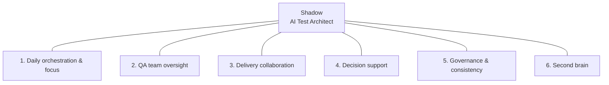

<div align="center">

# [Shadow](https://ElaMCB.github.io/Hyper-Agent/)

*Your AI test architect*

**Context keeper · Evidence gatherer · Draft producer**

</div>

---

> **Shadow** is the AI that runs in this repo. It shadows the Test Manager: QA team oversight, delivery collaboration, daily orchestration. You focus on directing and deciding; Shadow keeps the picture clear and the drafts ready.

**Hyper-Agent** is the project and repo that builds Shadow.

## Vision

How Shadow supports a Test Manager’s daily work:

**[→ Vision: AI Test Architect / Shadow](docs/VISION-ai-test-architect.md)**

Covers: daily brief & meeting prep, QA team oversight, delivery collaboration, decision support, governance, and your “second brain.”

### Capability diagram



| Area | Sub-capabilities |
|------|------------------|
| **1. Daily orchestration** | Morning brief · Priority stack · Meeting prep |
| **2. QA team oversight** | Commitment vs actuals · Single view · Escalation support · Consistency |
| **3. Delivery collaboration** | Scope ↔ test alignment · Release readiness · Communication |
| **4. Decision support** | Go/no-go evidence · Prioritization · Impact of changes |
| **5. Governance** | Standards · Patterns |
| **6. Second brain** | Status on demand · Your preferences |

*Full diagram set:* [docs/DIAGRAM-capabilities.md](docs/DIAGRAM-capabilities.md)

## Next steps

**[→ Recommended next steps](docs/NEXT-STEPS.md)** — first capability, data and tools, form factor, tech baseline.

**[→ How to build Shadow](docs/BUILD-PLAN.md)** — architecture, repo layout, data layer, first slice (morning brief), and order of work.

---

## Run

From the repo root:

**CLI (morning brief):**
```bash
pip install -r requirements.txt
python src/main.py brief
```

**API (deploy or run locally):**
```bash
uvicorn src.api:app --reload --host 0.0.0.0 --port 8000
```
Then open **http://localhost:8000/brief.md** for the brief, **http://localhost:8000/docs** for the API docs.

| Endpoint   | Description              |
|-----------|---------------------------|
| `GET /`   | Service info             |
| `GET /brief`   | Brief as JSON            |
| `GET /brief.md`| Brief as markdown        |
| `GET /health`  | Health check             |

**Deploy:** [docs/DEPLOY.md](docs/DEPLOY.md) — Railway, Render, Azure, or Docker.

Data: put `defects.json` and `test_runs.json` in `data/` (sample files are included). Optional: set `llm.enabled: true` in `config/config.yaml` and add `OPENAI_API_KEY` to `.env` for LLM-polished briefs.

---

## Repo

- **Private** — your space to design and build Shadow.
- **Status** — first slice (morning brief) implemented; more capabilities to follow.
