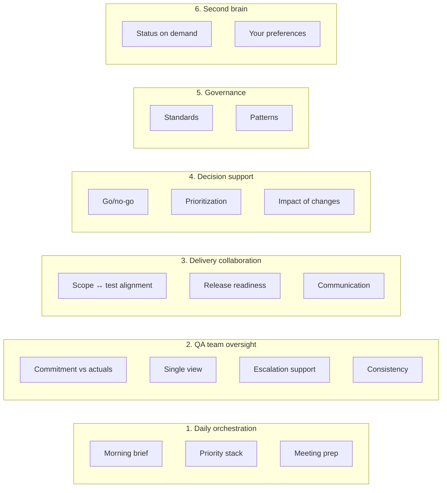
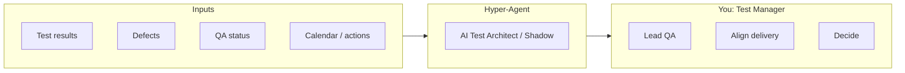

# Hyper-Agent: AI Shadow — Capability diagram

Predefined view of the AI Test Architect / Shadow and its capabilities.  
*(Renders on GitHub. See [Vision](VISION-ai-test-architect.md) for full text.)*

---

## 1. High-level: six capability areas

The shadow has **six predefined capability areas** around a single core role: context keeper, evidence gatherer, draft producer for the Test Manager.

```mermaid
flowchart TB
    subgraph agent["Hyper-Agent: AI Test Architect / Shadow"]
        CORE["Context keeper · Evidence gatherer · Draft producer"]
    end

    subgraph daily["1. Daily orchestration & focus"]
        direction TB
        D1["Morning brief"]
        D2["Priority stack"]
        D3["Meeting prep"]
    end

    subgraph qa_team["2. QA team oversight"]
        direction TB
        V1["Commitment vs actuals"]
        V2["Single view"]
        V3["Escalation support"]
        V4["Consistency"]
    end

    subgraph delivery["3. Delivery collaboration"]
        direction TB
        L1["Scope ↔ test alignment"]
        L2["Release readiness"]
        L3["Communication"]
    end

    subgraph decision["4. Decision support"]
        direction TB
        S1["Go/no-go evidence"]
        S2["Prioritization"]
        S3["Impact of changes"]
    end

    subgraph gov["5. Governance & consistency"]
        direction TB
        G1["Standards"]
        G2["Patterns"]
    end

    subgraph brain["6. Second brain"]
        direction TB
        B1["Status on demand"]
        B2["Your preferences"]
    end

    CORE --- daily
    CORE --- qa_team
    CORE --- delivery
    CORE --- decision
    CORE --- gov
    CORE --- brain
```

---

## 2. Detailed capability map

Each area and its sub-capabilities in one place.

---

## 3. Capability list (reference)

| # | Capability area | Sub-capabilities |
|---|-----------------|------------------|
| **1** | **Daily orchestration & focus** | Morning brief, Priority stack, Meeting prep |
| **2** | **QA team oversight** | Commitment vs actuals, Single view, Escalation support, Consistency |
| **3** | **Delivery collaboration** | Scope ↔ test alignment, Release readiness, Communication |
| **4** | **Decision support** | Go/no-go evidence, Prioritization, Impact of changes |
| **5** | **Governance & consistency** | Standards, Patterns |
| **6** | **Second brain** | Status on demand, Your preferences |

---

## 4. How the shadow fits your context

- **Inputs:** Data the agent can read (test runs, defects, QA commitments, calendar, actions).
- **Shadow:** Applies the six capability areas to produce briefs, prep, evidence, drafts.
- **You:** Use the outputs to lead your QA team, align with delivery, and make decisions.

---

*This diagram is the predefined capability definition for Hyper-Agent. Implementation follows [NEXT-STEPS](NEXT-STEPS.md).*
